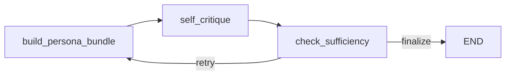
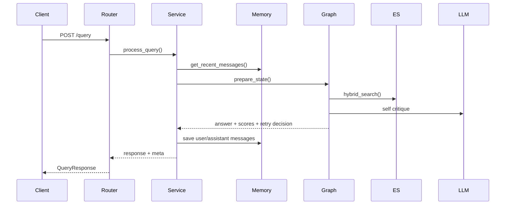

# rag-project

AIGEN을 이미 서비스 플랫폼 관점에서 설명했다면, 이 저장소는 그 다음에 보여주기 좋은 문서입니다.  
`rag-project`는 뉴스/공시/PDF를 모두 포괄하는 End-to-End 플랫폼이라기보다, **그 플랫폼의 기반이 되는 RAG 엔진을 더 작고 선명한 형태로 실험하고 검증한 연구용 서버**에 가깝습니다.

쉽게 말해 이렇게 설명할 수 있습니다.

- `AIGEN`이 서비스 전체 구조라면
- `rag-project`는 검색, 생성, 멀티턴 문맥, 근거성 같은 RAG 핵심 문제를 깊게 파고든 엔진 프로젝트입니다.

이 문서는 바로 그 관점에서, "이 저장소로 무엇을 연구했고 무엇을 구현했는가"를 발표형으로 설명하는 README입니다.

---

## 1. 이 프로젝트를 왜 따로 만들었는가

AIGEN 같은 운영형 AI 플랫폼을 만들다 보면, 서비스 전체를 한 번에 설명하는 것만으로는 부족할 때가 있습니다.  
실제 성능과 신뢰성을 좌우하는 것은 프론트엔드나 API 개수보다, 결국 **질문을 어떻게 해석하고, 문서를 어떻게 찾고, 그 문서로 답변을 얼마나 안정적으로 생성하는가**이기 때문입니다.

그래서 `rag-project`는 더 큰 플랫폼에서 한 걸음 물러나, 아래 질문을 집중적으로 검증하기 위한 저장소로 볼 수 있습니다.

- 멀티턴 대화에서 이전 문맥을 검색 질의에 언제 붙여야 하는가
- 사용자 성향(persona)을 검색과 생성에 어떻게 나눠 반영해야 하는가
- 검색 결과가 부족할 때 한 번 더 검색할지 어떻게 판단할 것인가
- 검색과 생성의 책임을 어떻게 분리해야 답변이 더 안정적이 되는가
- 외부 API 모양은 유지하면서 내부 RAG 엔진을 어떻게 실험할 수 있는가

즉 이 저장소의 목적은 "RAG 기능이 있다"가 아니라, **RAG 엔진을 더 설명 가능하고 더 실험 가능하게 만드는 것**입니다.

---

## 2. 한 줄로 요약하면

> Persona + Self-RAG 기반의 멀티턴 FastAPI RAG 서버로, 검색과 생성 책임을 분리하고 필요할 때만 재검색하는 가벼운 LangGraph 엔진입니다.

현재 핵심 스택은 아래와 같습니다.

- 검색: Elasticsearch hybrid search
- 생성/판단: Ollama LLM
- 오케스트레이션: LangGraph
- 서빙: FastAPI
- 세션/히스토리: memory store

---

## 3. 이 프로젝트에서 무엇을 특히 중요하게 봤는가

이 프로젝트는 RAG를 "문서를 찾고 붙이는 기술" 정도로만 보지 않았습니다.  
실제로는 아래 네 가지를 동시에 중요하게 봤습니다.

### 3.1 검색과 생성의 역할 분리

많은 RAG 시스템은 사용자 성향, 대화 문맥, 답변 스타일, 검색 힌트를 한 번에 섞어 프롬프트에 넣습니다.  
하지만 그렇게 되면 검색 질의가 오염되고, 검색에 불필요한 정보가 너무 많이 들어가서 오히려 retrieval precision이 떨어질 수 있습니다.  
그래서 이 프로젝트는 검색용 정보와 생성용 정보를 의도적으로 분리했습니다.  
즉 검색은 검색답게, 생성은 생성답게 다루겠다는 설계입니다.

### 3.2 멀티턴 문맥의 선택적 부착

이전 대화 문맥이 항상 검색에 도움이 되는 것은 아닙니다.  
어떤 질문은 직전 대화가 꼭 필요하지만, 어떤 질문은 독립적으로 충분히 검색할 수 있습니다.  
그래서 최근 사용자 문맥을 무조건 검색 질의에 붙이지 않고, **작은 판단용 LLM 프롬프트가 붙일지 말지를 결정**하도록 했습니다.  
이렇게 하면 follow-up 질문에는 강해지고, 독립 질문에서는 질의가 불필요하게 길어지는 문제를 줄일 수 있습니다.

### 3.3 가벼운 Self-RAG

Self-RAG를 너무 무겁게 설계하면, 구조는 멋있어 보여도 실제 서비스에서는 응답 속도와 운영 복잡도가 커질 수 있습니다.  
이 프로젝트는 Self-RAG를 "복잡한 다중 에이전트"가 아니라, **현재 검색 결과가 충분한지 확인하고 필요할 때만 한 번 더 검색하는 가벼운 구조**로 설계했습니다.  
즉 리트라이를 하되, 무조건 여러 번 도는 것이 아니라 꼭 필요할 때만 돌게 했습니다.

### 3.4 안정적인 API shape

엔진 내부는 계속 실험해도, 외부에서 쓰는 API 형태는 최대한 안정적으로 유지하는 것이 중요합니다.  
그래야 프론트엔드나 다른 서비스가 엔진 실험 때문에 계속 흔들리지 않습니다.  
그래서 이 프로젝트는 내부 그래프를 바꾸더라도 `/query`, `/query/stream`, `/search/*` 같은 외부 인터페이스는 명확하게 유지하는 방향을 택했습니다.  
즉 "실험 가능한 엔진"과 "안정적인 서비스 경계"를 동시에 가져가려는 구조입니다.

---

## 4. 현재 엔진 구조는 어떻게 생겼는가

현재 활성 파이프라인은 아래 3개 노드로 구성된 매우 단순한 그래프입니다.



핵심 흐름은 다음과 같습니다.

1. `build_persona_bundle`
2. `self_critique`
3. `check_sufficiency`
4. 필요하면 최대 2회까지 재검색

이 구조가 중요한 이유는, 단계 수는 적지만 각 단계의 책임이 아주 분명하기 때문입니다.

- 첫 단계는 "무엇을 검색할지"를 정리합니다.
- 두 번째 단계는 "지금 문서로 답할 수 있는지"를 판단합니다.
- 세 번째 단계는 "한 번 더 검색할지 말지"를 결정합니다.

즉 이 엔진은 복잡한 구조보다 **판단 지점을 명확히 드러내는 구조**를 목표로 합니다.

---

## 5. 각 노드를 발표용으로 풀어서 설명하면

### 5.1 `build_persona_bundle`

이 노드는 말 그대로 "이번 질문에 필요한 검색 묶음"을 만드는 단계입니다.

실제로 하는 일은 아래와 같습니다.

- 세션 프로필 조회
- 최근 대화 요약 생성
- 검색용 `retrieval_query` 생성
- 생성용 `generation_hints` 생성
- Elasticsearch hybrid search 실행

여기서 가장 중요한 설계 포인트는 **`retrieval_query`와 `generation_hints`를 분리했다는 점**입니다.

`retrieval_query`에는 검색에 필요한 정보만 들어갑니다.  
즉, 검색기가 문서를 찾는 데 진짜 필요한 표현만 넣으려고 합니다.

반면 `generation_hints`에는 이런 정보가 들어갑니다.

- 답변 스타일
- 선호 주제
- 개인화 메모

즉 이 정보들은 답변을 더 사용자 맞춤형으로 만드는 데 쓰이지만, 검색 질의 자체를 오염시키지 않도록 분리됩니다.

발표에서는 이 노드를 이렇게 설명하면 이해가 빠릅니다.

> 사용자의 질문을 그대로 던지는 것이 아니라, 검색에 필요한 정보와 답변 개인화 정보를 분리해서 준비하는 단계입니다.

### 5.2 `self_critique`

이 노드는 이 프로젝트의 핵심입니다.  
검색된 문서를 바탕으로 답변을 만들고, 동시에 그 답변이 충분한지 스스로 평가합니다.

즉 한 번의 단계 안에서 아래 세 가지를 수행합니다.

- 검색된 문서만 기반으로 답변 생성
- 현재 문서가 충분한지 평가
- 부족하면 더 나은 `next_query` 생성

현재 이 단계는 아래와 같은 형태의 JSON을 출력합니다.

```json
{
  "answer": "final answer text",
  "is_sufficient": true,
  "utility_score": 4.2,
  "confidence": 0.81,
  "insufficiency_reasons": [],
  "next_query": "better retrieval query if needed"
}
```

이 출력이 중요한 이유는, 단순히 텍스트 답변만 내놓는 것이 아니라 **현재 상태를 다음 단계가 해석 가능한 구조적 신호로 바꾼다**는 점입니다.

발표에서는 이렇게 설명할 수 있습니다.

> 이 노드는 답변을 만드는 동시에, "지금 자료로 충분한가"를 스스로 따져보고, 부족하면 다음 검색 문장까지 제안하는 자기 점검 단계입니다.

### 5.3 `check_sufficiency`

마지막 노드는 매우 단순하지만 운영적으로 중요합니다.

- `is_sufficient=true`면 종료
- `loop_count < max_loops`이면 재검색
- 아니면 종료

기본 설정은 `SELF_RAG_MAX_LOOPS=2`입니다.

이 말은, 이 엔진이 부족할 때 무한히 다시 검색하는 구조가 아니라는 뜻입니다.  
필요할 때만 제한적으로 재시도하고, 그 결과를 외부로 메타데이터로 드러냅니다.  
이 점이 실제 서비스에서 응답 시간과 예측 가능성을 관리하는 데 중요합니다.  
즉 "스스로 다시 찾아보는 능력"과 "무한정 느려지지 않는 제어"를 동시에 가져가려는 설계입니다.

---

## 6. Persona는 어떻게 반영되는가

이 프로젝트는 persona를 과하게 밀어붙이지 않습니다.  
검색과 생성이 서로 다른 목적을 갖기 때문에, persona도 목적별로 나눠 반영합니다.

### 6.1 검색 쪽 반영

최근 user 문맥이 필요한 경우에만 아래 정보가 검색 질의에 붙습니다.

- `Recent user context:`
- `Topic hints:`

중요한 것은 "항상 붙는 것이 아니라, 필요하다고 판단될 때만 붙는다"는 점입니다.  
즉 follow-up 질문에는 도움이 되지만, standalone 질문에는 검색을 흐리지 않도록 제어합니다.

### 6.2 생성 쪽 반영

생성 단계에는 아래 정보가 `generation_hints`로 전달됩니다.

- `response_style`
- `preferred_topics`
- `explicit_notes`

이 정보들은 답변 말투나 서술 방향에 영향을 주지만, 검색 질의에 직접 섞이지 않습니다.  
이렇게 해야 검색은 검색 품질 중심으로 유지하고, 생성은 개인화와 표현 품질을 챙길 수 있습니다.

한 문장으로 정리하면 이렇습니다.

> persona를 쓰되, 검색과 답변 생성을 같은 방식으로 개인화하지 않고 서로 다른 책임에 맞춰 분리해 반영했습니다.

---

## 7. LLM은 어디에서 쓰이는가

현재 활성 파이프라인에서 LLM은 크게 두 군데에서 사용됩니다.

### 7.1 `context_attachment_prompt`

최근 user 문맥을 검색 질의에 붙일지 판단합니다.  
즉 "이 질문은 앞 대화 맥락이 꼭 필요한가"를 따지는 작은 결정 단계입니다.

이 부분이 중요한 이유는, 멀티턴 질문에서는 문맥 부착이 검색 품질을 높일 수 있지만, 모든 질문에 문맥을 붙이면 오히려 검색이 흐려질 수 있기 때문입니다.

### 7.2 `selfrag_critique_prompt`

이 프롬프트는 아래 세 가지를 동시에 담당합니다.

- 답변 생성
- 충분성 판단
- 다음 검색 질의 제안

즉 이 프로젝트에서 LLM은 단순 생성기 역할만 하지 않습니다.  
문맥 해석기이자, 충분성 판정기이자, 재검색 제안기 역할까지 함께 맡습니다.  
이 점이 "그냥 답하는 챗봇"과 "상태를 보고 다음 행동을 정하는 엔진"의 차이입니다.

---

## 8. 검색은 어떻게 설계했는가

이 프로젝트의 검색은 Elasticsearch 기반 **hybrid search**입니다.  
즉 벡터 검색과 키워드 검색을 함께 사용합니다.

### 8.1 왜 하이브리드 검색인가

벡터 검색은 의미적으로 비슷한 문서를 찾는 데 강합니다.  
하지만 정확한 고유명사, 숫자, 특정 표현을 찾는 데는 키워드 검색이 더 유리할 수 있습니다.  
반대로 키워드 검색은 단어가 정확히 일치하지 않으면 놓치기 쉽고, 의미 검색은 이 약점을 보완합니다.  
그래서 두 방식을 함께 쓰는 것이 RAG 품질을 더 안정적으로 만드는 경우가 많습니다.

### 8.2 이 저장소에서의 구현 포인트

현재 `build_persona_bundle` 단계에서는 아래와 같이 hybrid search를 실행합니다.

- 검색 엔진: Elasticsearch
- 검색 개수: `TOP_K_RESULTS`
- 벡터 가중치: `vector_weight=0.5`

즉 의미 기반 검색과 키워드 기반 검색을 균형 있게 병합하려는 기본 전략을 사용합니다.

발표에서는 이렇게 요약하면 좋습니다.

> 이 엔진은 한 가지 검색기만 믿지 않고, 의미 검색과 키워드 검색을 함께 써서 검색 누락과 오탐을 동시에 줄이려 했습니다.

---

## 9. 질문이 들어오면 실제로 무슨 일이 일어나는가

사용자가 `/query`에 질문을 보내면 내부에서는 아래 흐름이 실행됩니다.



쉽게 풀면 이렇습니다.

### 9.1 세션 히스토리 조회

서비스 레이어가 먼저 `memory_store`에서 최근 대화를 가져옵니다.  
이 단계가 있어야 follow-up 질문인지 standalone 질문인지 판단할 수 있습니다.

### 9.2 초기 상태 준비

`GraphState`에 아래 같은 정보가 들어갑니다.

- 현재 질문
- 세션 ID
- 최근 대화 히스토리
- 검색 결과
- generation hints
- self-rag 점수
- 현재 loop 수

즉 이 프로젝트는 상태 기반 워크플로우를 택했고, LangGraph는 그 상태를 단계별로 흘려보내는 역할을 합니다.

### 9.3 검색 실행

`build_persona_bundle`가 검색용 질의를 만들고 Elasticsearch hybrid search를 실행합니다.

### 9.4 답변 생성 + 충분성 평가

`self_critique` 단계가 답변과 함께 충분성 점수, confidence, 다음 질의를 생성합니다.

### 9.5 재검색 여부 결정

`check_sufficiency`가 retry 또는 finalize를 결정합니다.

### 9.6 히스토리 저장과 메타 반환

최종 답변은 메모리 저장소에 기록되고, 응답에는 아래 같은 메타가 함께 담깁니다.

- `selfrag_scores`
- `loop_count`
- `is_sufficient`
- `last_retrieval_query`
- `retrieval_scores`

이 메타 정보는 발표할 때 꽤 좋은 포인트입니다.  
왜냐하면 이 엔진이 단순히 "답변 문자열 하나"만 내놓는 게 아니라, **내부에서 어떤 판단을 했는지 외부에 드러내는 구조**이기 때문입니다.

---

## 10. 스트리밍 API에서는 무엇이 보이는가

이 프로젝트는 `/query/stream`도 지원합니다.  
스트리밍에서는 단순히 답변 토큰만 흘리는 것이 아니라, 엔진 내부 단계를 이벤트로 보여줄 수 있습니다.

현재 주요 이벤트는 아래와 같습니다.

- `retrieve_start`
- `retrieve_end`
- `self_critique_start`
- `self_critique_end`
- `retry`
- `done`
- `error`

이 구조는 프론트엔드나 운영 화면에서 매우 유용합니다.  
사용자는 "지금 검색 중인지", "재검색 중인지", "최종 답변 단계인지"를 더 잘 이해할 수 있고, 개발자는 디버깅과 관찰이 쉬워집니다.  
즉 스트리밍을 UX뿐 아니라 **엔진 관찰 가능성(observability)** 관점에서도 설계한 셈입니다.

---

## 11. 주요 파일을 보면 구조가 더 선명해진다

발표에서는 파일 이름을 너무 많이 나열할 필요는 없지만, 핵심 파일 몇 개는 짚어주면 좋습니다.

- 그래프: `apps/graphs/rag_graph.py`
- 상태 모델: `apps/models/state.py`
- 서비스 레이어: `apps/services/service.py`
- 질의 API: `apps/routers/query.py`
- 검색 API: `apps/routers/search.py`
- 벡터 스토어: `apps/stores/vector_store.py`
- attach 판단 프롬프트: `apps/prompts/context_attachment_prompt.py`
- self-rag 프롬프트: `apps/prompts/selfrag_critique_prompt.py`

한 문장씩 설명하면 다음과 같습니다.

- `rag_graph.py`: 이 저장소의 핵심 엔진 로직이 있는 곳
- `state.py`: 단계 간에 어떤 정보를 주고받는지 정의하는 곳
- `service.py`: API 요청을 그래프 실행으로 연결하는 서비스 계층
- `query.py`: 외부에서 실제로 호출하는 질의 엔드포인트
- `vector_store.py`: Elasticsearch hybrid search를 담당하는 검색 계층

즉 이 프로젝트는 "모델 호출 코드" 한 파일이 아니라, **검색, 상태, 그래프, API가 분리된 구조적 서버**입니다.

---

## 12. API는 어떤 의미를 가지는가

이 저장소의 엔드포인트는 단순하지만 발표하기에 충분히 명확합니다.

### 12.1 질의 계열

- `POST /query`
- `POST /query/stream`
- `POST /query/feedback`

이 API들은 각각 아래 의미를 가집니다.

- `/query`: 일반 질의응답
- `/query/stream`: 스트리밍 질의응답
- `/query/feedback`: 사용자 피드백을 받아 profile/persona 업데이트

즉 이 프로젝트는 질문만 처리하는 것이 아니라, **질문 이후 피드백이 다음 응답에 반영되는 구조**까지 일부 갖추고 있습니다.

### 12.2 세션 계열

- `GET /session/{session_id}/profile`
- `GET /session/{session_id}/history`

이 API들은 멀티턴 문맥과 persona 상태를 외부에서 확인할 수 있게 해줍니다.  
즉 세션 기반 대화 엔진이라는 점이 API 레벨에서도 드러납니다.

### 12.3 문서/검색 계열

- `POST /document/add`
- `POST /document/upload`
- `POST /search/vector`
- `POST /search/keyword`
- `POST /search/hybrid`

이 API들은 RAG 엔진을 블랙박스로만 두지 않고, 문서 적재와 검색 기능을 독립적으로 확인할 수 있게 해줍니다.  
발표에서는 이 부분을 "검색 엔진을 따로 점검할 수 있는 실험 구조"라고 설명해도 좋습니다.

---

## 13. 테스트와 평가에서 무엇을 확인했는가

이 저장소는 단순히 동작만 보는 것이 아니라, 현재 설계가 의도대로 작동하는지 테스트 코드로 검증합니다.

### 13.1 Persona + Self-RAG 통합 테스트

`tests/test_persona_selfrag_integration.py`에서는 특히 이런 점을 확인합니다.

- retrieval query에 검색 관련 정보만 들어가는지
- generation hints에 persona 정보가 제대로 정리되는지
- assistant 응답이나 불필요한 스타일 정보가 검색 질의를 오염시키지 않는지
- self-rag가 same query를 불필요하게 재사용하지 않도록 normalize하는지
- loop cap이 의도대로 동작하는지

즉 이 프로젝트는 "아이디어 차원"이 아니라, **설계 원칙이 실제 코드에서 지켜지는지 테스트로 고정해둔 상태**입니다.

### 13.2 Query API 응답 형태 테스트

`tests/test_query_api.py`에서는 다음을 확인합니다.

- `/query` 응답 shape가 안정적인지
- `/query/stream` 이벤트 세트가 의도대로 나가는지
- 메타데이터가 외부 응답에 제대로 실리는지

이건 발표할 때 꽤 좋은 포인트입니다.  
엔진 실험은 계속하되, 응답 형태는 함부로 바뀌지 않게 관리하고 있다는 뜻이기 때문입니다.

### 13.3 RAGAS 평가 스크립트

이 저장소에는 별도 `RAGAS + Vertex AI` 평가 가이드와 스크립트도 있습니다.

- 가이드: `RAGAS_VERTEX_AI.md`
- 스크립트: `scripts/ragas_vertex_eval.py`

즉 이 프로젝트는 로컬 엔진 실험에만 머무르지 않고, golden set 기반의 외부 평가 루프까지 포함하고 있습니다.  
말하자면 "돌아간다"를 넘어서 **"얼마나 잘 돌아가는가"를 측정하려는 구조**입니다.

---

## 14. 이 프로젝트에서 내가 했다고 설명할 수 있는 일

발표에서는 결국 이 질문으로 돌아옵니다.  
"그래서 이 저장소에서 너는 뭘 만들었는데?"라는 질문입니다.

이 프로젝트에서는 아래처럼 정리하는 것이 가장 자연스럽습니다.

### 14.1 멀티턴 RAG 엔진 구조화

사용자 질문, 세션 히스토리, persona, 검색 결과, self-rag 판단을 상태 기반 그래프로 묶어, 엔진 전체 흐름이 코드상에서 명확히 보이도록 만들었습니다.

### 14.2 검색과 생성의 책임 분리

retrieval query와 generation hints를 분리해, 검색 정밀도를 해치지 않으면서도 개인화 답변 품질을 유지하는 구조를 설계했습니다.

### 14.3 가벼운 Self-RAG 도입

복잡한 multi-agent 구조 대신, 현재 문서가 충분한지 판단하고 필요할 때만 재검색하는 경량 self-rag 루프를 설계했습니다.

### 14.4 스트리밍과 메타데이터 노출

단순 답변뿐 아니라 loop count, sufficiency, retrieval query, retrieval scores 같은 내부 신호를 응답과 스트리밍 이벤트로 드러내도록 만들었습니다.

### 14.5 검색 계층 실험 가능성 확보

문서 적재 API와 `vector/keyword/hybrid` 검색 API를 분리해, 생성 이전 단계의 retrieval 품질을 따로 관찰하고 실험할 수 있게 구성했습니다.

### 14.6 테스트 기반 안정화

persona 반영, self-rag 동작, API shape 유지 같은 핵심 설계 원칙을 테스트 코드로 고정해두어, 이후 구조를 바꿔도 핵심 품질이 무너지지 않도록 했습니다.

한 문장으로 요약하면 다음처럼 말할 수 있습니다.

> 저는 이 프로젝트에서 멀티턴 문맥, persona, hybrid retrieval, self-rag retry를 하나의 LangGraph 엔진으로 구조화하고, 그 결과를 FastAPI와 테스트 가능한 형태로 정리하는 역할을 했습니다.

---

## 15. 실행 방법

```bash
python -m venv .venv
```

Windows:

```bash
.venv\Scripts\activate
```

macOS/Linux:

```bash
source .venv/bin/activate
```

설치:

```bash
pip install -r requirements.txt
```

서버 실행:

```bash
cd apps
python main.py
```

Swagger:

- `http://localhost:8000/docs`

---

## 16. 환경 변수

주요 설정은 아래와 같습니다.

- `OLLAMA_BASE_URL` 또는 `OLLAMA_HOST`
- `OLLAMA_MODEL`
- `EMBEDDING_MODEL`
- `ELASTICSEARCH_URL` 또는 `ES_HOST`
- `ELASTICSEARCH_INDEX` 또는 `ES_INDEX`
- `ELASTICSEARCH_USER` 또는 `ES_ID`
- `ELASTICSEARCH_PASSWORD` 또는 `ES_API_KEY`
- `SELF_RAG_MAX_LOOPS`
- `TOP_K_RESULTS`

샘플 파일:

- `.env.sample`

---

## 17. 테스트 실행

현재 회귀 확인에 자주 쓰는 테스트는 아래와 같습니다.

```bash
pytest tests/test_persona_selfrag_integration.py tests/test_query_api.py
```

RAGAS 평가를 별도로 돌리고 싶다면 아래 문서를 참고하면 됩니다.

- `RAGAS_VERTEX_AI.md`

---

## 18. 이 저장소의 의도를 한 문장으로 정리하면

이 프로젝트는 복잡한 multi-agent PersonaRAG를 그대로 구현하기보다, 아래 원칙에 맞춘 현실적인 구조를 목표로 합니다.

- 검색용 정보와 생성용 정보를 분리한다.
- follow-up 여부는 고정 규칙보다 LLM이 문맥적으로 판단한다.
- Self-RAG는 가볍게 유지하고, 필요할 때만 재검색한다.
- 외부 API shape는 안정적으로 유지한다.

즉 `rag-project`는 "AIGEN 이전 단계"라기보다, **AIGEN 같은 더 큰 시스템을 떠받치는 RAG 엔진 사고방식을 더 선명하게 드러낸 저장소**라고 설명하는 것이 가장 정확합니다.

---

## 19. 발표 마무리 멘트

마지막에는 이렇게 정리하면 자연스럽습니다.

> AIGEN이 서비스 전체를 보여주는 프로젝트였다면, `rag-project`는 그 서비스의 핵심부인 RAG 엔진을 더 작고 선명하게 해부한 저장소입니다.  
> 여기서는 멀티턴 문맥을 언제 검색에 붙일지, persona를 어떻게 검색과 생성에 나눠 반영할지, 검색이 부족할 때 어떻게 스스로 한 번 더 찾아볼지를 LangGraph 기반의 가벼운 엔진으로 구현하고 검증했습니다.
