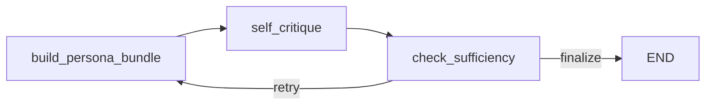

# rag-project

이 프로젝트를 가장 쉽게 설명하면, **노션, 옵시디언 같은 메모와 내가 가진 문서를 AI가 읽고 찾아서 답하게 만드는 개인 지식 RAG 서버**입니다.

조금 더 풀어서 말하면 이렇습니다.

- 내가 평소에 정리해 둔 노션 페이지가 있고
- 옵시디언처럼 마크다운으로 쌓아둔 메모가 있고
- PDF, TXT, DOCX 같은 파일도 있는데
- 이 자료들을 그냥 쌓아두는 것이 아니라
- AI가 질문을 받았을 때 그 자료를 먼저 찾아보고, 그걸 근거로 답하게 만드는 프로젝트입니다.

즉 이 저장소의 목적은 "챗봇 만들기"가 아니라, **내 메모와 문서를 AI가 이해 가능한 지식베이스로 바꿔서 검색하고 답하게 만드는 것**입니다.

---

## 1. 이 프로젝트는 무엇을 해결하려고 했는가


보통 사람들은 메모를 여러 군데에 흩어놓습니다.

- 노션에 회의 정리
- 옵시디언에 개인 공부 노트
- PDF로 받은 자료
- 워드 파일이나 텍스트 파일

문제는, 자료가 많아질수록 "찾아보는 시간"이 더 오래 걸린다는 점입니다.  
무엇을 어디에 적어뒀는지 기억이 잘 안 나고, 검색어를 정확히 기억하지 못하면 찾기도 어렵습니다.  
게다가 문서가 길면 찾은 뒤에도 다시 읽어서 요점을 뽑아야 합니다.

그래서 이 프로젝트는 이런 상황을 해결하려고 했습니다.

> 내가 저장해둔 메모와 문서를 AI가 대신 찾아보고, 질문에 맞는 내용을 골라서 설명해주게 하자.

예를 들면 이런 식입니다.

- "지난번에 노션에 적어둔 검색 품질 관련 메모 정리해줘"
- "내 옵시디언 노트 기준으로 Self-RAG가 왜 필요한지 설명해줘"
- "업로드한 PDF에서 하이브리드 검색 관련 부분만 요약해줘"
- "내 문서 기준으로 답하고, 근거가 부족하면 그렇게 말해줘"

즉 이 프로젝트는 공개 웹 검색을 중심으로 한 AI보다, **내가 직접 쌓은 지식과 문서를 중심으로 대답하는 AI**를 만드는 데 초점이 있습니다.

---

## 2. 쉽게 말해 RAG가 왜 필요한가

여기서 핵심 기술이 바로 RAG입니다.

RAG는 `Retrieval-Augmented Generation`의 줄임말인데, 어렵게 들리지만 개념은 단순합니다.

- 먼저 관련 문서를 찾고
- 그 문서를 읽은 뒤
- 그 내용을 바탕으로 답을 생성하는 방식입니다.

사람으로 비유하면 이렇습니다.

- 그냥 LLM만 쓰는 것은 "기억에 의존해서 바로 말하는 사람"입니다.
- RAG는 "먼저 노트를 뒤져보고, 그다음 답하는 사람"입니다.

개인 메모 프로젝트에서 RAG가 중요한 이유는 분명합니다.

- LLM은 내 노션 내용을 원래 알지 못합니다.
- LLM은 내 옵시디언 메모를 기본적으로 기억하지 못합니다.
- LLM은 내가 방금 업로드한 PDF를 자동으로 알고 있지 않습니다.

그래서 이런 개인 자료를 AI가 활용하게 하려면, 먼저 그 자료를 검색 가능한 형태로 바꾸고, 질문이 들어왔을 때 거기서 관련 내용을 찾아와야 합니다.  
이 프로젝트는 바로 그 역할을 하는 서버입니다.

---

## 3. 이 프로젝트를 한 문장으로 요약하면

> 노션 페이지와 마크다운 메모, PDF/TXT/DOCX 파일을 벡터 검색 가능한 지식으로 바꾸고, 멀티턴 문맥과 persona를 반영해 답변하는 FastAPI 기반 개인 지식 RAG 엔진입니다.

현재 핵심 기술 스택은 아래와 같습니다.

- 검색: Elasticsearch hybrid search
- 생성/판단: Ollama LLM
- 오케스트레이션: LangGraph
- API: FastAPI
- 세션 저장: memory store
- 외부 지식 입력: Notion import + 파일 업로드

---

## 4. 어떤 데이터를 넣을 수 있는가

이 프로젝트는 "내 문서를 AI가 읽게 하는 것"이 목적이기 때문에, 입력 경로가 중요합니다.

### 4.1 노션 페이지

노션 API를 통해 페이지를 가져올 수 있습니다.  
이때 단순 제목만 가져오는 것이 아니라, 블록 구조를 따라가며 내용을 읽고 `Document` 형태로 변환한 뒤 검색 가능한 문서로 적재합니다.

즉 발표에서는 이렇게 말하면 됩니다.

> 노션에 정리한 메모를 RAG 지식베이스로 가져올 수 있게 만들었습니다.

### 4.2 옵시디언 메모

옵시디언 전용 API가 붙어 있는 것은 아니지만, 실제 옵시디언 메모는 대부분 `md` 파일입니다.  
이 프로젝트는 `md` 파일 업로드와 처리 로직을 가지고 있기 때문에, **옵시디언 메모를 마크다운 파일 형태로 넣어서 RAG 대상으로 사용할 수 있습니다.**

즉 실무적으로는 이렇게 설명하면 자연스럽습니다.

> 옵시디언 메모도 결국 마크다운 기반이기 때문에, md 파일을 넣어 개인 지식 검색 대상으로 삼을 수 있습니다.

### 4.3 일반 파일

이 프로젝트는 아래 파일 형식을 처리합니다.

- `txt`
- `pdf`
- `docx`
- `md`

즉 단순 메모 앱뿐 아니라, 강의자료, 회의록, 보고서, 논문 요약 같은 개인 문서도 함께 넣을 수 있습니다.

---

## 5. 전체적으로 보면 이 프로젝트는 어떤 흐름인가

이 프로젝트를 아주 쉽게 그리면 아래 흐름입니다.


1. 먼저 내 메모와 문서를 넣습니다.
2. 시스템이 이 문서를 검색 가능한 형태로 저장합니다.
3. 사용자가 질문합니다.
4. 시스템이 관련 문서를 먼저 찾습니다.
5. 그 문서를 바탕으로 답변합니다.
6. 필요하면 한 번 더 검색합니다.

즉 핵심은 "AI가 똑똑해서 답한다"가 아니라, **AI가 내 자료를 먼저 뒤져보고 답한다**는 점입니다.

---

## 6. 왜 이 프로젝트에 멀티턴과 persona가 들어가는가

이런 식으로 묻는다고 생각해보면 됩니다.

1. "내 노트에서 hybrid search 설명해줘"
2. "그중에서 BM25 부분만 더 자세히"
3. "이번엔 쉽게 설명해줘"

이때 2번과 3번 질문은 앞선 대화를 알아야 제대로 해석할 수 있습니다.  
그래서 이 프로젝트는 **세션 히스토리**를 저장하고, 필요하면 최근 사용자 문맥을 검색 질의에 붙입니다.

또 사람마다 원하는 답변 방식이 다를 수 있습니다.

- 짧고 간단하게
- 근거 위주로
- 기술적으로 자세하게

그래서 persona 정보도 반영할 수 있게 만들었습니다.  
다만 중요한 점은, persona를 검색 질의와 답변 생성에 무작정 똑같이 넣지 않는다는 것입니다.  
검색은 검색 품질 중심으로, 생성은 표현과 개인화 중심으로 따로 다룹니다.

즉 이 프로젝트는 "내 문서를 찾는 AI"에서 한 걸음 더 나아가, **대화 맥락과 사용자 취향까지 반영하는 개인 지식 도우미**를 목표로 합니다.

---

## 7. 현재 엔진은 어떻게 동작하는가

현재 활성 그래프는 아래 3개 노드로 구성됩니다.



핵심 흐름은 다음과 같습니다.

1. `build_persona_bundle`
2. `self_critique`
3. `check_sufficiency`
4. 필요하면 최대 2회까지 재검색

이 구조는 복잡해 보일 수 있지만, 발표할 때는 이렇게 설명하면 됩니다.

- 1단계: 이번 질문에 맞는 검색 준비
- 2단계: 검색 결과로 답변하고, 지금 자료가 충분한지 점검
- 3단계: 부족하면 한 번 더 찾을지 결정

즉 이 엔진은 "찾고, 답하고, 스스로 점검하는" 구조입니다.

---

## 8. 각 단계는 실제로 무슨 일을 하는가

### 8.1 `build_persona_bundle`

이 단계는 "이번 질문을 어떤 식으로 검색할지" 정리하는 노드입니다.

실제로 하는 일은 아래와 같습니다.

- 세션 프로필 조회
- 최근 대화 요약 생성
- Elasticsearch hybrid search 실행


### 8.2 `self_critique`

이 단계는 검색된 문서를 바탕으로 답변을 만들고, 그 답변이 충분한지도 같이 평가합니다.

즉 아래 세 가지를 함께 수행합니다.

- 검색된 문서 기반으로 답변 생성
- 현재 문서가 충분한지 판단
- 부족하면 더 나은 `next_query` 생성

이 단계는 단순 텍스트만 반환하지 않고, 구조화된 판단 결과를 냅니다.

```json
{
  "answer": "final answer text",
  "is_sufficient": true,
  "utility_score": 4.2,
  "confidence": 0.81,
  "insufficiency_reasons": [],
  "next_query": "better retrieval query if needed"
}
```

즉 이 엔진은 답변만 만드는 것이 아니라, **지금 답변이 얼마나 믿을 만한지에 대한 신호도 함께 만든다**는 점이 특징입니다.

### 8.3 `check_sufficiency`

이 단계는 아주 단순하지만 중요합니다.

- `is_sufficient=true`면 종료
- 아니고 `loop_count < max_loops`면 재검색
- 아니면 종료

기본 설정은 `SELF_RAG_MAX_LOOPS=2`입니다.

즉 이 프로젝트는 "모르면 무한히 다시 찾는 구조"가 아니라, **제한된 범위 안에서만 다시 찾아보는 가벼운 Self-RAG**를 택했습니다.

---

## 9. 검색은 어떻게 하는가

이 프로젝트의 검색은 Elasticsearch 기반 **hybrid search**입니다.

쉽게 말하면 두 가지 검색을 같이 씁니다.

- 벡터 검색: 의미가 비슷한 문서를 찾음
- 키워드 검색: 단어가 직접 맞는 문서를 찾음

왜 둘 다 쓰냐면 이유는 간단합니다.

- 벡터 검색은 의미는 잘 찾지만, 정확한 키워드에는 약할 수 있고
- 키워드 검색은 정확한 단어는 잘 찾지만, 의미가 비슷한 표현을 놓칠 수 있습니다.

그래서 둘을 함께 쓰는 것이 개인 메모 검색에도 더 안정적입니다.  
예를 들어 내가 노트에 "retrieval quality"라고 적었는데, 질문은 "검색 품질"이라고 할 수도 있기 때문입니다.

즉 이 프로젝트는 "단어 맞춤 검색기"가 아니라, **내 문서를 더 현실적으로 찾기 위한 검색기**를 지향합니다.

---

## 10. 어떤 API가 있는가

이 프로젝트의 API는 크게 네 덩어리로 볼 수 있습니다.

### 10.1 질의 API

- `POST /query`
- `POST /query/stream`
- `POST /query/feedback`

의미는 아래와 같습니다.

- `/query`: 일반 질의응답
- `/query/stream`: 스트리밍 질의응답
- `/query/feedback`: 사용자 피드백을 반영해 profile/persona 업데이트

### 10.2 세션 API

- `GET /session/{session_id}/profile`
- `GET /session/{session_id}/history`

이 API는 멀티턴 대화와 persona 상태를 확인하는 용도입니다.

### 10.3 문서 API

- `POST /document/add`
- `POST /document/add_batch`
- `POST /document/upload`
- `GET /document/count`
- `DELETE /document/{doc_id}`

이 API는 내가 가진 문서를 직접 지식베이스에 넣는 기능입니다.

### 10.4 노션 API

- `POST /notion/import`

이 API는 노션 페이지를 바로 가져와서 RAG 문서로 적재하는 역할을 합니다.

### 10.5 검색 API

- `POST /search/vector`
- `POST /search/keyword`
- `POST /search/hybrid`

이 API는 생성 이전 단계의 검색 품질을 따로 실험하고 확인할 수 있게 해줍니다.

발표에서는 이걸 이렇게 정리하면 좋습니다.

> 이 프로젝트는 단순 챗봇 API 하나가 아니라, 문서 적재, 노션 연동, 세션 관리, 검색 실험, 질의응답이 모두 분리된 실험용 RAG 서버입니다.

---

## 11. 파일 처리와 노션 연동은 어떻게 되어 있는가

### 11.1 파일 업로드 처리

파일 업로드는 `apps/routers/document.py`와 `apps/utils/file_processor.py`가 담당합니다.

현재 처리 가능한 형식은 아래와 같습니다.

- TXT
- PDF
- DOCX
- MD

특히 옵시디언 메모를 발표에서 연결해서 설명하고 싶다면, 이 부분이 중요합니다.  
옵시디언 메모는 사실상 `md` 파일이기 때문에, 이 프로젝트는 옵시디언 메모를 파일 업로드 방식으로 흡수할 수 있습니다.

### 11.2 노션 연동

노션 연동은 `apps/routers/notion.py`와 `apps/utils/notion_connector.py`가 담당합니다.

이 모듈은 단순히 노션 제목만 가져오는 것이 아니라,

- 페이지 속성
- 블록 구조
- rich text
- child page 재귀 탐색

까지 고려해 페이지 내용을 문서화합니다.

즉 이 프로젝트는 노션을 "링크만 참고하는 수준"이 아니라, **실제로 RAG 검색 가능한 지식으로 가져오는 수준**까지 다룹니다.

---

## 12. 스트리밍에서는 무엇이 보이는가

`/query/stream`에서는 답변만 흘리는 것이 아니라, 내부 진행 상황도 이벤트로 보여줄 수 있습니다.

현재 주요 이벤트는 아래와 같습니다.

- `retrieve_start`
- `retrieve_end`
- `self_critique_start`
- `self_critique_end`
- `retry`
- `done`
- `error`

이건 사용자 경험에도 좋지만, 발표 관점에서도 포인트가 있습니다.  
왜냐하면 이 시스템이 블랙박스처럼 한 번에 답만 내놓는 것이 아니라, **검색 시작, 점검, 재검색 같은 내부 단계를 드러내는 설명 가능한 엔진**이라는 뜻이기 때문입니다.

---

## 13. 테스트로 무엇을 검증했는가

이 프로젝트는 아이디어만 있는 것이 아니라, 핵심 설계를 테스트로 묶어두고 있습니다.

### 13.1 Persona + Self-RAG 통합 테스트

`tests/test_persona_selfrag_integration.py`에서는 아래 같은 것을 확인합니다.

- retrieval query에 검색 관련 정보만 들어가는지
- generation hints에 persona 정보가 제대로 들어가는지
- assistant 응답이 검색 질의를 오염시키지 않는지
- self-rag가 같은 질문을 불필요하게 반복하지 않는지
- loop cap이 의도대로 동작하는지

즉 "검색과 생성을 분리한다"는 설계가 실제 코드에서도 지켜지는지 검증하고 있습니다.

### 13.2 Query API 테스트

`tests/test_query_api.py`에서는 아래를 확인합니다.

- `/query` 응답 shape가 안정적인지
- `/query/stream` 이벤트가 의도대로 나가는지
- 메타데이터가 응답에 실리는지

즉 이 프로젝트는 내부 엔진을 실험하더라도, 외부 API 형태는 쉽게 흔들리지 않도록 관리합니다.

### 13.3 RAGAS 평가 가이드

별도 문서 `RAGAS_VERTEX_AI.md`와 `scripts/ragas_vertex_eval.py`를 통해 golden set 기반 평가 루프도 갖고 있습니다.

즉 이 프로젝트는 "동작한다" 수준을 넘어서, **얼마나 잘 동작하는지 측정하려는 구조**까지 포함합니다.

---

## 14. 발표에서 “내가 한 일”은 어떻게 설명하면 좋은가

이 부분은 발표에서 가장 중요할 수 있습니다.  
이 프로젝트에서 했다고 말할 수 있는 일을 정리하면 아래와 같습니다.

### 14.1 개인 지식 RAG 서버 설계

노션과 파일 기반 문서를 AI가 읽고 답하게 만드는 전체 서버 구조를 설계했습니다.

### 14.2 메모 입력 경로 연결

노션 import, 파일 업로드, 마크다운 처리 흐름을 통해 개인 메모를 지식베이스로 적재할 수 있게 만들었습니다.

### 14.3 멀티턴 문맥 처리

세션 히스토리를 기반으로 follow-up 질문을 이해하고, 필요할 때만 최근 문맥을 검색 질의에 붙이도록 설계했습니다.

### 14.4 persona와 retrieval 분리

답변 스타일과 개인화 정보는 생성 단계에 반영하고, 검색 질의는 최대한 깨끗하게 유지하도록 구조를 분리했습니다.

### 14.5 가벼운 Self-RAG 루프 설계

검색 결과가 충분한지 판단하고, 필요할 때만 한 번 더 검색하는 경량 self-rag 구조를 만들었습니다.

### 14.6 검색 실험 가능한 API 제공

vector, keyword, hybrid 검색을 각각 API로 노출해 retrieval 품질을 독립적으로 실험할 수 있게 했습니다.

한 문장으로 줄이면 이렇게 말할 수 있습니다.

> 저는 이 프로젝트에서 노션과 메모 파일을 AI가 읽을 수 있는 지식으로 바꾸고, 그 지식을 기반으로 멀티턴 대화와 개인화 답변이 가능한 RAG 서버를 설계하고 구현했습니다.

---

## 15. 실행 방법

```bash
python -m venv .venv
```

Windows:

```bash
.venv\Scripts\activate
```

macOS/Linux:

```bash
source .venv/bin/activate
```

설치:

```bash
pip install -r requirements.txt
```

서버 실행:

```bash
cd apps
python main.py
```

Swagger:

- `http://localhost:8000/docs`

---

## 16. 환경 변수

주요 설정:

- `OLLAMA_BASE_URL` 또는 `OLLAMA_HOST`
- `OLLAMA_MODEL`
- `EMBEDDING_MODEL`
- `ELASTICSEARCH_URL` 또는 `ES_HOST`
- `ELASTICSEARCH_INDEX` 또는 `ES_INDEX`
- `ELASTICSEARCH_USER` 또는 `ES_ID`
- `ELASTICSEARCH_PASSWORD` 또는 `ES_API_KEY`
- `NOTION_TOKEN`
- `SELF_RAG_MAX_LOOPS`
- `TOP_K_RESULTS`

샘플 파일:

- `.env.sample`

---

## 17. 자주 보는 주요 파일

- 그래프: `apps/graphs/rag_graph.py`
- 상태 모델: `apps/models/state.py`
- 서비스 레이어: `apps/services/service.py`
- 질의 API: `apps/routers/query.py`
- 문서 업로드 API: `apps/routers/document.py`
- 노션 import API: `apps/routers/notion.py`
- 검색 API: `apps/routers/search.py`
- 벡터 스토어: `apps/stores/vector_store.py`
- 노션 커넥터: `apps/utils/notion_connector.py`
- 파일 처리기: `apps/utils/file_processor.py`

---

## 18. 마무리 한 문장

> 이 프로젝트는 내 노션, 옵시디언 메모, PDF와 문서를 AI가 대신 찾아보고 설명하게 만드는 개인 지식 RAG 서버이며, 그 안에서 멀티턴 문맥, persona, hybrid search, self-rag까지 실험한 엔진 프로젝트입니다.
